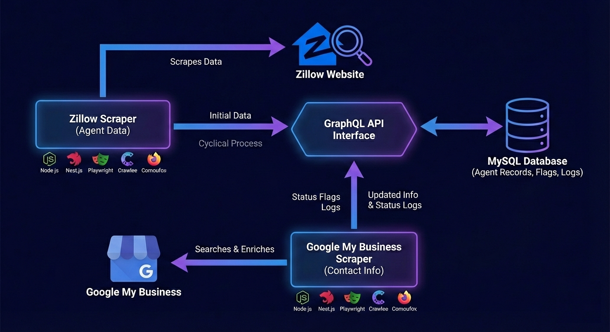

# Project
Web Scraper - Zillow + Google My Business Extraction

# Description
Built a two-stage scraping and enrichment system that collects real estate agent data from Zillow, enriches each agent with verified business details from Google Business profiles, and stores everything in MySQL with run-level status tracking, per-record flags, and audit logs.

Tech Workflow

# Challenge
Data fragmentation: Zillow has agent info, but business details are scattered across Google listings.
Scale + reliability: Needed to process many agents repeatedly without duplicates, broken runs, or silent failures. Plus need data city wise.
Traceability: Each run needed clear visibility into what succeeded, failed, or was skipped, per record and per run.
Automation stability: Browser scraping must survive dynamic pages, retries, and anti-bot friction.

# Solution
Implemented Scraper #1 (Zillow Collector) to extract agent records and persist them to MySQL.
Implemented Scraper #2 (GMB Enricher) to pick agents from DB, search Google by realtor name, extract business profile details (address, phone, website, reviews, socials), then update the same record.

Added an orchestrated run system with:
Run status (started/running/success/failed)
Per-record flags (zillow_status, gmb_status)
Retry + backoff logic, and idempotent updates
Structured logs + audit trail for debugging and reporting

# Tech Stack
- Backend: Node.js, NestJS
- Orchestration: Crawlee
- Scraping: Playwright, Camoufox
- Database: MySQL
- API: GraphQL
- Monitoring: Run logs + status flags + enrichment logs (application-level observability)

# Highlight
Two-stage pipeline: Extraction → enrichment → DB update (repeatable and modular).
Idempotent processing: Safe re-runs without duplicating records.
Operational visibility: Every run and record has clear status + timestamps + error context.
Extensible design: Easy to add more enrichment sources later (LinkedIn, broker site, MLS directory, etc.)

---
*Disclaimer applied